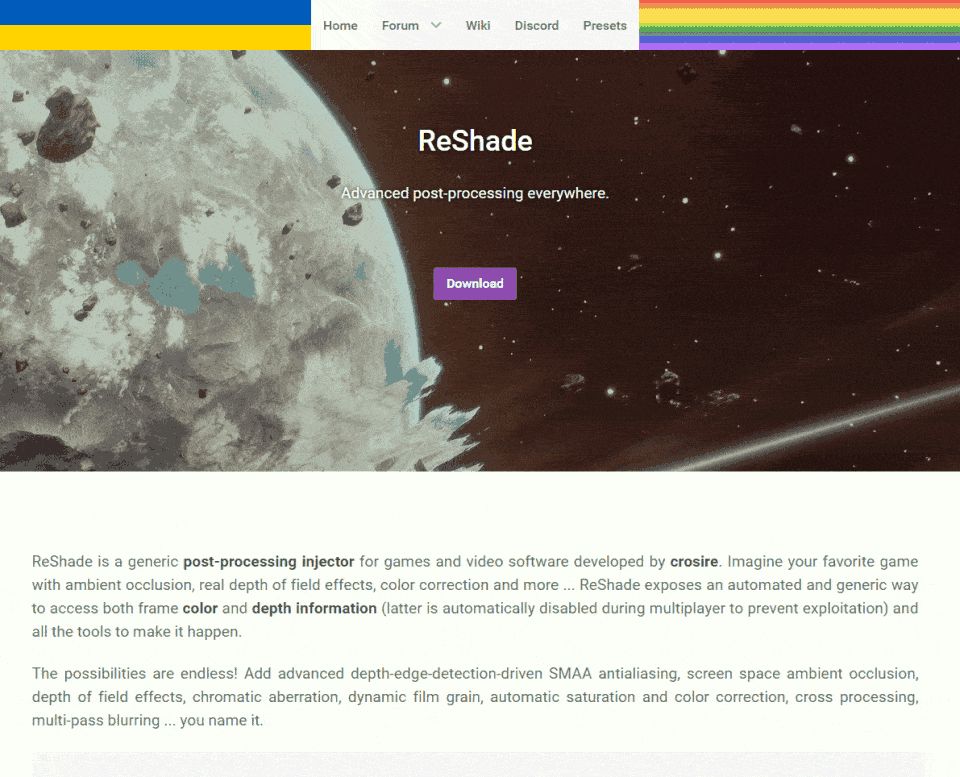
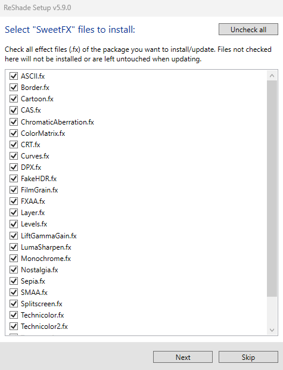

# ReShade Guides

{: style="max-width:17%" }

ReShade is a post-processing shader-injection tool that works with all games and applications supporting DirectX 9-12, OpenGL, and Vulkan graphics rendering APIs. 

Like utilities such as ENB, DXVK, or ASILoader, ReShade integrates seamlessly with your game by injecting through the rendering API, offering a wide range of visual customization options.

This guide aims to simplify the ReShade installation process and introduce you to its basic and advanced features!

---

Downloading the ReShade Installer

Begin by downloading the most recent version of ReShade from the [official website](https://reshade.me/#download).

{: .warning }
**Safety first!** Only download ReShade from its official site to avoid malicious files and potential threats. Stay vigilant!

Once you're on the official ReShade website, navigate to the bottom section that displays the latest versions available for download.

You'll find two distinct ReShade builds:

---

## Standard ReShade Build (Download ReShade x.x.x)

The Standard ReShade Build is tailored for online games with strict anti-cheat mechanisms. 

If you're an avid player of online games like Dead by Daylight, PUBG, or Apex Legends, this build is for you.

However, to ensure compatibility with online games, this build limits some advanced features, such as disabling add-ons when a network connection is detected in your game.

This measure prevents misuse of ReShade for cheating or code injection.

---

## Full Add-On Support ReShade Build (Download ReShade x.x.x with full add-on support)

The Full Add-on Support ReShade Build is ideal for offline games or online games that lack robust anti-cheat systems.

If you enjoy games like Final Fantasy XXIV, World of Warcraft, or Baldur's Gate 3, this is the ReShade build for you!

This build supports the full array of ReShade's features and add-ons, offering maximum creative freedom. It allows users to inject a wide range of enhancements into their game, including depth-based shaders like iMMERSE MXAO, iMMERSE Pro RTGI, or StageDepthPlus.

However, remember that using this version of ReShade in online games with anti-cheat solutions can lead to bans. While typically you'll receive a warning before a ban, some systems may enforce immediate bans, so caution is advised!

{: .warning }
**Fair play is the best play!** Using shaders or add-ons to gain an unfair advantage in games can lead to bans. Always respect the game rules, and expect bans for bypassing these rules by any means!

---

How to Use the ReShade Installer

This guide will help you navigate the ReShade Installer and install ReShade with ease. Don't worry if you're new to this, we've made it simple for everyone!

---

Choosing Your Game

After you've chosen the right installer for your game type, launch it. You'll be asked to select a game or application.

You can choose from the games and applications installed on your PC,

If your game doesn't appear in the selection menu, don't fret! You can manually browse for your game executable by clicking the `Browse...` button at the bottom.

The browse function lets you pinpoint the executable you want to inject ReShade into. This is particularly useful for games from platforms like itch.io, classic games, or emulators like DOSBox and Dolphin.

  * If you are having trouble finding the proper location for your game directory or executable, check out our guide on [finding your game directory and executable](https://guides.martysmods.com/docs/special_other/finding_your_game_executable.html) for help!

---

Choosing the Rendering API

Rendering APIs like DirectX, Vulkan, or OpenGL are tools that developers use to communicate with your computer hardware for drawing and presenting visuals on screen.

Each game uses a specific rendering API, so it's vital to select the correct one for ReShade to inject properly!

  * If you're not sure about your game's rendering API, resources like the [PCGamingWiki](https://pcgamingwiki.com) can be a great help! But if you want to guess your game's API without research, here are some general guidelines:

---

DirectX 9 was widely used from 2005 to 2012. There are many DirectX 9 titles that you can inject ReShade into - however, most modern games are likely to use other rendering APIs.

---

DirectX 10-12 is common in engines like Unity and Unreal Engine. It's the go-to choice for most modern games and is the standard for many graphics developers.

---

OpenGL is used by certain engines and older games. If DirectX isn't an option and your game isn't extremely old, OpenGL is probably the way to go.

---

Vulkan is popular in modern emulators and some newer game releases. For Linux users (using Wine or Proton), Vulkan is a must.

{: .important }
Vulkan installations require admin permissions due to certain system-level changes. Denying this might hinder the ReShade installation.

---

Installing Presets

Installing presets has been made simple with the ReShade Installer, as the ReShade Installer is able to auto-detect the required shaders for selected presets, eliminating all the guesswork required in finding the shaders that you would need for each preset.

{: note }
If your preset requires unique shaders and textures outside the installer's offerings, you may need to install them manually.

To attach a preset, hit the `Browse...` button in the installer. 

All ReShade presets will be an `.ini` file, these `.ini` files hold all the configurations that others have made to specific shaders, load orders, and hotkeys.

If you do not have a preset, you can skip this portion of the installer by simply hitting `Next`!

---

Installing Shaders Using the ReShade Installer

Shaders are the backbone of ReShade's flexibility and power, enabling users to create unique visual experiences for each game.

Finding and sourcing shader collections can be tricky as individual Shader Developers have their own storage and update methods. 

However, the ReShade installer streamlines this process.

If you've chosen to install a preset with the preset installation page of the ReShade Installer, the necessary shaders will be pre-selected in this section; if not, only `Standard Effects` will be selected.

In the shader installation section, two symbols represent installation options:

* A **square tick** allows selective shader installation from a specific repository.

  

* A **check tick** installs all shaders from the selected repository.

  

For more information on individual Shader Developers and their repositories, click on the blue-highlighted repository or author names. This will take you to their online repository location, which often contains detailed shader information and descriptions useful for users.

After selecting the shaders you want, click on `Next.`

{: .note }
> Choosing the square tick for any shader repositories will bring up the `Select {shader repository name} files to install` screen. 
> 
> From here, select your preferred shaders and click `Next` to continue.

---

Finishing the Installation Process

Once the ReShade installation is complete, a confirmation screen will show a successful installation.

* Click `Finish` and start your game.

  

* If installed correctly, ReShade will show an in-game banner:

  

* If you encounter issues at this point, the most common problem is selecting the wrong API or executable!

