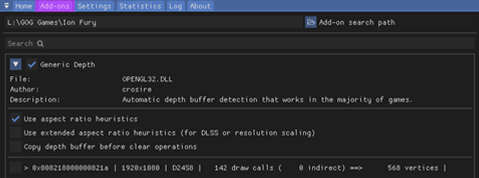
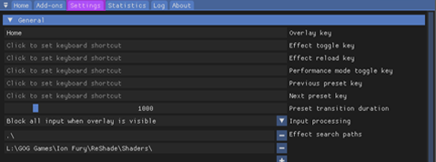

Once you've successfully installed ReShade and launched your game, look for the ReShade popup at the top of the screen. If it's there, congrats! You're already 70% of the way there.

If ReShade is not showing up in your game, go back to the ReShade Installer and try a different rendering API or executable - it is likely that you have picked the wrong one.

---

# Getting to Know ReShade's UI

To make the most of ReShade, it's a good idea to get to know its UI.

Press the `HOME` key (or `POS1` on some keyboards, depending on your locale) to bring up the on-screen tutorial. 

If you're new to ReShade, stick with this tutorial - it'll cover the basics and give you a solid foundation for what's next. Don't skip it!

If you've already skipped the tutorial, don't worry - we'll go through each feature and section in this guide. 

Understanding these will really pay off later, especially when you start exploring more advanced topics like the Depth Buffer.

---

Exploring the Home Tab

The `Home` tab in ReShade is a key hub, brimming with shaders and their configurations ready for you to explore. 

Here's a breakdown of each part of the `Home` tab:

Current Preset

---

The highlighted section above shows the active preset in ReShade. By default, presets are saved in the game directory in a file named `ReShadePreset.ini`. 

On the right side of the `Home` tab, use the `+` button to create a new preset, the diskette icon to save your preset, and the `<` and `>` arrows to switch between preset files in your current game directory.

ReShade will smartly identifies which `.ini` files are presets, ensuring a smooth user experience. However not all `.ini` files related to ReShade will be preset files.

* This file, installed by the ReShade Installer, will not be ReShade preset files, but it ends in `.ini`
  * ReShade.ini

---

Understanding the Technique List

* The highlighted area below shows ReShade's `Technique List` within the `Home` tab:

  

This section lists all the shaders installed by you or the ReShade Installer. 

Consequently, the list's size will vary depending on the chosen preset and the shader repositories you've set up with the ReShade Installer or other more manual methods.

---

Global Pre-processor Definitions

* The spotlighted area below shows the `Edit Global Preprocessor Definitions` button:

  

Pre-Processor definitions serve as toggles that guide the behavior of effects before they load. Changes here can affect shader functionality or compatibility.

* Clicking the `Edit Global Preprocessor Definitions` button button opens a small window showing a `Global` tab:

  

The primary tab shows `Global` definitions, applies all definitions listed to all presets. ReShade will set some defaults - however you can add, edit, or remove them using the `+` and `-` signs shown!

{: .note }
It's important to know the pre-processor definition name and its range when configuring these options. Shaders often include this info in their comments. Use advanced text editors (like [Notepad++](https://notepad-plus-plus.org/) or [Visual Studio Code](https://code.visualstudio.com/)) to inspect FX files and their contents!

* The secondary tab displays pre-processor definitions for the `Current Preset`:

  

These current preset global pre-processors change or reset based on the shader's default pre-processor definitions or their global value when you alter the preset. 

This is often useful when different presets need unique pre-load settings.

{: .note }
With a default ReShade preset, the `Current Preset` tab will be empty, so do not panic if you do not see anything on a fresh install of the default ReShade preset

---

Understanding Effect Parameters

* The image shown below highlights the effect parameters of shaders:

  

When you activate a shader in ReShade, its corresponding options and parameters will appear in the highlighted section.

Any changes you make to these parameters will be reflected in real-time. 

It's useful to position the window slightly to the side so that you can view the real-time image changes of each shader configuration that you apply!

---

Understanding the Reload Button

* The highlighted `Reload` button in the image prompts ReShade to recheck the files in the Shaders and Textures folder:

  

Clicking the `Reload` button in ReShade incorporates newly installed effects without requiring a game restart. It will also mirror modifications made to the shader code during its development.

---

Understanding Performance Mode

* The `Performance Mode` setting highlighted in the image below optimizes compilation processes and ReShade's memory operations, minimizing performance overhead:

  

It is worth keeping in mind that `Performance Mode` limits edits to shader parameters (this is expected behavior of ReShade,) and some effects may not function correctly. 

**Always** report any inconsistencies with Performance Mode to the shader creator.

---

Understanding the Add-ons Tab

* The `Add-ons Tab` shown in the image below is responsible for managing each ReShade Add-on:

  

By default, only `Generic Depth` is included with the ReShade Installer - however there are many other ReShade Add-ons that you can install to ReShade.

Generic Depth in ReShade is responsible for retrieving the depth buffer and selecting the appropriate one. The depth buffer is a critical component in 3D graphics, used to determine the distance of each pixel in a rendered scene from the viewer's perspective. In the context of ReShade, the depth buffer is used to apply effects like depth of field, ambient occlusion, and more. These effects can significantly enhance the visual quality of a game or video, adding a level of realism and immersion.

The `Add-ons` Tab in ReShade serves as a control panel for managing the various Add-ons that can be used with ReShade. Each `Add-on` provides additional functionality or enhancements to the ReShade shaders that you currently have installed. For instance, some `Add-ons`` may offer new effects, while others may provide tools for fine-tuning existing effects!

The `Add-ons` Tab also allows you to enable or disable individual add-ons, and control those specific Add-ons with their given arguments (if they have any) - giving you control over which features are active at any given time. This can be particularly useful for troubleshooting, as you can disable Add-ons or change configurations within Add-ons one by one to identify any that may be causing issues.

In addition to `Generic Depth`, other popular Add-ons, such as [ShaderToggler - FransBouma](https://github.com/FransBouma/ShaderToggler), [ReShade Effect Shader Toggler - 4lex4nder](https://github.com/4lex4nder/ReshadeEffectShaderToggler), and [AutoHDR - MajorPainTheCactus](https://github.com/MajorPainTheCactus/AutoHDR-ReShade). Each of these Add-ons can significantly alter the behavior of each ReShade shader and game it is applied to, making them powerful tools for customizing the visual experience for each user.

We'll explore the depth buffer and `Generic Depth` in more detail later, but keep in mind that these Add-on can alter the behavior of each ReShade shader and game it is applied to - as it's very powerful, and can allow any developer's code to inject into the game!

---

Exploring the Settings Tab

* The `Settings` tab depicted in the image below allows you to adjust various crucial ReShade settings—such as directories for Shaders, keys for menu access, FPS meter configurations, theme settings, and more:

  

This guide will be here to help you get to know these options for a better experience with ReShade!

Below are dropdowns that provide information about the key settings, per dropdown in ReShade, you can adjust within the ReShade `Settings` Tab:

General Menu

1. `Keybindings`: 

  * Here, you can set the keybindings for various actions in ReShade. This allows you to customize the controls to your liking. 
  
    * As each setting is self explanitory, there is no need to go over them in detail, however, these are the options for hotkeys set.

      * `Overlay key`

      * `Effect toggle key`

      * `Effect reload key`

      * `Performance mode toggle key`

      * `Previous preset key`
    
      * `Next preset key`

2. `Preset transition duration`:

  * This setting allows you to change the transition between preset files. This is counted in Miliseconds.

    * 1 Second is equal to 1000 Miliseconds!

---

3. `Input processing`:

  * This setting allows for users to change the default behavior of ReShade's input control

    * `Pass on all input` - Allows your game to also recieve inputs from your keyboard and mouse, regardless of where they are on the game window.

    * `Block input when cursor is on overlay` - Allows the game to recieve inputs from your keyboard and mouse only when they are off of the ReShade UI.

    * `Block all input when overlay is visible` (default option) - Disallows the game to recieve all inputs from your keyboard and mouse when the ReShade overlay is active.

---

4. `Start-up preset`:

  * This argument allows for ReShade to utilize a preset to use once your game has started.

    * The default behavior of ReShade is to load the last used preset from the user, however, you can change this behavior with this function by defining a preset file path!

    * By default this argument will be blank - as it requires a user to specify what preset that they want started.
    

---

5. `Effect...` and `Texture search paths`: 

  * This setting allows you to specify where ReShade should look for shader files.
  
  You can add multiple directories here for ReShade to look through, and ReShade will search all of them when looking for shaders. 
  
  * The default options for ReShade's `Effect...` and Texture search paths are:

    * `Effect search paths` - `.\ReShade-Shaders\Shaders\**`

    * `Texture search paths` - `.\ReShade-Shaders\Textures\**`

---

6. `Load only enabled effects`:

  * This option allows for the options that are selected in your current ReShade preset to be loaded.

    * This can prevent issues with conflicting files/techniques used from other shaders

    * This option can also reduce the compile time needed on the start of ReShade

---

7. `Clear effect cache`:

  * This option allows you to clear the cache for the shaders that are compiled in ReShade.

    * Sometimes issues with shaders can occur that this fixes.

---

Screenshots Menu

1. `Screenshot key`:

  * This option is a keybind setup argument for screenshots, the default is `Print Screen` which is generally located above the `Insert` and `Home` keys on most standard keyboards. 
    * If you do not have a `Print Screen` key, you can rebind the screenshot function here.

---

2. `Screenshot path`:

  * Like other paths before, this option is for ReShade's location to save screenshots. 
    * By default this is set to `.\`. This means that ReShade will save screenshots to the directory that the ReShade binary `.dll` file is located in!

---

3. `Screenshot name`:

  * This is an advanced option for users that allows each user to specically specify what they want each screenshot to have included in it. 
  
    * This function utilizes macros in it's arguments to allow for real-time data to be ported over to the screenshot name.

    * The macros that can be used within this argument are listed below:

      * %AppName% - Name of the current application.

      * %PresetName% - Name of the preset applied at the moment of a screenshot.

      * %Date% - Current date argument (in the format of '%s' or seconds.)

		  * %DateYear% - Year component of current date.

		  * %DateMonth% - Month component of current date.

		  * %DateDay% - Day component of current date.

		  * %Time% - The current time argument (in format of '%s' or seconds.)

		  * %TimeHour% - Hour component of the current time.

		  * %TimeMinute% - Minute component of the current time.

		  * %TimeSecond% - Second component of the current time.

		  * %TimeMS% - Milliseconds fraction of the current time.

      * %Count% - Number of screenshots taken within your current session.

---

4. `Screenshot format`:

  * This argument allows you to change the extension of files, and allow for different compression processing of your screenshots. 

    * Listed below are the arguments that you can choose from, as well as what you can expect from them

      * `Bitmap (*.bmp)` - You would choose this if you want a purely lossless file that you can easily edit - however, note that this option takes up the most space on your hard drive! 
      
        * Keep in mind, that this option makes your image not easily sharable online if you are wanting to share.

        * With this option selected, you are will be given the option to enabled `Clear alpha channel`. Clearing the alpha channel completely clears the transparency layer of images, providing you an image without black if shaders support creating alpha channels to the screen/screenshot.

      * `Portable Network Graphics (*.png)` - You would choose this if you want a lossy file, that is almost identical to the original with some pulled out data that the general user will never notice. You will also want to choose this if you are wanting to share the files online for others to view! 
      
        * This is the default option selected within ReShade!

        * With this option selected, you are will be given the option to enabled `Clear alpha channel`. Clearing the alpha channel completely clears the transparency layer of images, providing you an image without black if shaders support creating alpha channels to the screen/screenshot.

      * `JPEG (*.jpeg)` - You would choose this option if you want a compressed file. While not close to the original output of the image, it allows for the user to save on storage, and bandwidth if they are sharing online. 

        * Upon choosing this option, you will get a new argument to change the compression quality of the image that is selected!

---

5. `Save current preset file`:

  * This option will allow the user to save the preset used at the time the screenshot is taken.

---

6. `Save before and after images`:

  * This option will allow the user to take two screenshots on the same frame:

    * One of the original output without ReShade

    * One with the edited output with ReShade

---

7. `Save separate image with the overlay visable`:

  * This option allows you to save a seperate image from the original, or the one with ReShade effects applied to it. This image will include the ReShade UI in a seperate file.

    * This is really good for sharing if you are seeking out a solution!

---

8. `Screenshot sound`:

  * This option allows you to choose a specific sound that you would like ReShade to play when you take a screenshot.
  
    * This option only allows for `.wav` files types to be played upon taking a screenshot.

---

9. `Post-save command`:

  * This option is highly advanced, and allows the users to port their screenshots into external software in order to edit upon saving.
    
    * The option is specifically for pointing to the executable that you will be utilizing.

---

10. `Post-save command arguments`:

  * This option allows the users to specify what arguments are passed to the executable that was provided in `Post-save command`

    * This argument allows support for macros to specify:

      * %AppName% - Name of the current application.

      * %PresetName% - Name of the preset applied at the moment of a screenshot.

      * %Date% - Current date argument (in the format of '%s' or seconds.)

		  * %DateYear% - Year component of current date.

		  * %DateMonth% - Month component of current date.

		  * %DateDay% - Day component of current date.

		  * %Time% - The current time argument (in format of '%s' or seconds.)

		  * %TimeHour% - Hour component of the current time.

		  * %TimeMinute% - Minute component of the current time.

		  * %TimeSecond% - Second component of the current time.

		  * %TimeMS% - Milliseconds fraction of the current time.

      * %TargetPath% - Lists the full path of the screenshot file to the Post-save software.

      * %TargetDir% - Lists the directory of the of the screenshot file to the Post-save software.

      * %TargetFileName% - Lists the full name of the of the screenshot file to the Post-save software.

      * %TargetExt% - Lists the extension of the of the screenshot file to the Post-save software.

      * %TargetName% - Lists the name of the of the screenshot file without the file extension to the Post-save software.

      * %Count% - Number of screenshots taken within your current session.

11. `Post-save command working directory`:

  * This argument allows for the user to define the area that the software they want to execute for Post-save processing is in.

12. `Hide post-save command window`:

  * This toggle allows for the user to state if they want the window of the application that they have specified to make Post-save processing to visable or hidden.

    * By default this option is set to off, allowing the program to fully open and be visable to the user.

---

Overlay & Styling

1. `Restart tutorial`:

  * This button allows you to completely restart the tutorial of ReShade that you should have seen at the first launch of your game with ReShade injected.

---

2. `Show screenshot message`:

  * This toggle allows you to disable the screenshot notification message

---

3. `Group effect files with tabs instead of a tree`:

  * This toggle allows for the user to select if they want the default behavior of ReShade to place all of the arguments of shaders that are configurable within a tree structure, or within a grouped structure.
    
    * Generally a grouped structure allows for more organization, however, this option is purely preference based.

    * By default this option is left off, and the tree structuring for shader configuration arguments is used.

---

4. `Global Style`

  * This option allows for the user to choose through a few distinct themes for ReShade.
    
    * Below are listings and images of what each preset looks like for the user:

      * `Default`:

        
      
      * `Dark`:

        

      * `Light`:

        

      * `Custom Simple`:

        * This option allows you to define your own color configuration for ReShade.
      
      * `Custom Advanced`:

        * More advanced option of `Custom Simple`.

      * Solarized Dark:

        

      * Solarized Light:

        

---

---

Getting to Know the Statistics Tab

The `Statistics Tab` shown in the image provides performance statistics, effect utilization, consumption rates, visual appearances per pass, and more. 

Generally, this isn't a frequent stop unless you're creating or analyzing a shader's performance.

---

Deciphering the Log Tab

The `Log Tab` highlighted in the image displays ReShade’s log, documenting the shader loading process and ReShade's overall operations. 

If a shader encounters issues, they'll appear here: 

  * YELLOW indicates a warning (when an effect loads, but could have better, optimized code or experienced mid-load alterations).

  * RED signals an error, usually with an explanatory note. 

This tool is invaluable to developers when crafting shaders.

If something seems off, share the error text or the log file (stored in the game directory as ReShade.log). 

However, logs are reset each game restart, so share logs before rebooting to avoid data loss.

---

Appreciating the About Tab

The `About Tab`, visible in the image, credits the contributors behind ReShade's development, acknowledges licenses, and other supportive codes. 

It's a formal acknowledgment.

---

# Understanding ReShade's Depth Buffer

The depth buffer in a game tells what in the game has “depth”, as in, what is actually 3D, and what is just a plane. 

It is the basis for effects such as Ambient Occlusion to detect what occludes and what doesn’t, and for Depth of Field to detect what is close to the camera and what isn’t. Without that, those effects don’t know what is close and far, and can’t work. 

In the next few steps, you will learn how to identify a depth buffer, how to see if it works, common issues which makes the detection not possible, and so on.

{: .warning}
> Make sure you correctly set-up ReShade and followed the previous steps on the other pages! 
> 
> This guide will be made on the basis that you followed all of the instructions there and got ReShade set-up and running correctly.

---

Understanding Depth Buffer Basics

Before diving in, it's crucial to understand what each part and color of the Depth Buffer signifies. 

This section will explain each component, what to look out for, and how to handle each case.

---

{: .warning}
> IMPORTANT: BEFORE PROCEEDING, GO TO YOUR GAME GRAPHICS SETTINGS, AND DISABLE THE FOLLOWING:
>
> * MSAA ANTIALIASING
>
> * SSAA ANTIALIASING
>
> FXAA or TXAA is acceptable, as they don’t erase the depth-buffer information by doing multiple samples

If your screen resembles the image above, the shader has loaded correctly and is functioning as expected. 

However, note that we're not quite finished, as there are still some inaccuracies in the displayed details.

{: .important }
> If your shader resembles the images below, it lacks data. You should revisit the previous steps and carefully read the instructions on what to disable.
> 
> 
> 
> This image shows what the depth buffer shader looks like without data.
> 
> 
> 
> This image shows what the shader looks like when it lacks data and is reversed.

---

Understanding Global Preprocessor Basic Arguments

This section will guide you through the basic arguments that are presented to the ReShade Depth Buffer.

---

RESHADE_DEPTH_INPUT_IS_REVERSED

This argument is used when you can see the normals, but the depth image itself is not visible (The first result image should illustrate this perfectly). It usually starts at 1, so setting it to 0 should fix the issue. However, the solution could also be the reverse.

---

RESHADE_DEPTH_INPUT_IS_UPSIDE_DOWN

As the name suggests, this argument is used when the image displayed by the DisplayDepth shader is upside down. Setting it to 1 should rectify the problem.

---

RESHADE_DEPTH_INPUT_IS_LOGARITHMIC

This argument is used when the depth buffer displays numerous waves or "stripes". Very FEW games actually utilize this, so it's rare that you'll need to toggle or modify this setting.

---

Understanding Global Preprocessor Advanced Arguments

These advanced options will seldom require modification. However, for older games or emulators, you might need to adjust them. Below, you'll find a general description of these arguments.

---

RESHADE_DEPTH_INPUT_X_SCALE | RESHADE_DEPTH_INPUT_Y_SCALE

These arguments modify the depth buffer size (with 1 representing the original size, 2 being double, and so forth) along the horizontal (X) and vertical (Y) axes.

---

RESHADE_DEPTH_LINEARIZATION_FAR_PLANE

This argument defines the "infinite" distance in the depth buffer. 

The values can be either extremely low or high, so you'll need to experiment to determine the best fit for your specific case.

---

RESHADE_DEPTH_MULTIPLIER

This argument multiplies the far plane, facilitating the visualization of extremely low or high far plane values.

