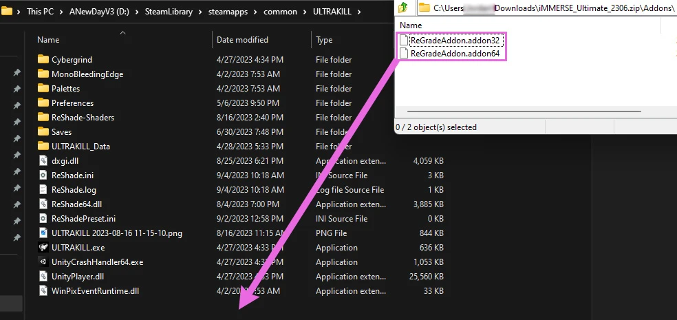
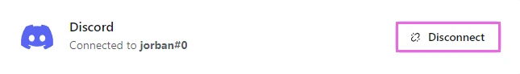
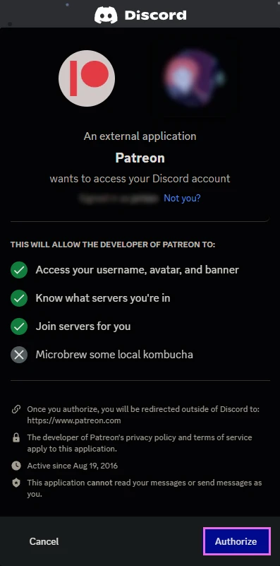

# Patreon Shaders FAQ

Below will be drop downs for general questions that get asked about iMMERSE, iMMERSE Pro, and iMMERSE Ultimate.

 What does Marty's Mods have

## iMMERSE:

iMMERSE is the core repository of shaders from Marty's Mods and are available [on GitHub](https://github.com/martymcmodding/iMMERSE). The iMMERSE repository includes:

| **iMMERSE: Shaders** | **Description:** |
| Launchpad | A shader designed to process information for both RTGI and ReLight |
| MXAO | A robust and powerful ambient occlusion shader that can take advantage of irradiance bitfields |
| Sharpen | A contrast based sharpening shader that can take depth into account |
| Anti-Aliasing | ReShade's fastest SMAA shader avlaible |

---

## iMMERSE Pro:

iMMERSE Pro is a premium repository of shaders provided by Marty's Mods, available to [the "Raytracers" tier members from Pascal's Patreon](http://www.patreon.com/mcflypg). For $5 USD, you can access this repository, which currently features:

| **iMMERSE Pro: Shaders** | **Description:** |
| RTGI | State of the art ray traced global illumination for ReShade |
| Clarity | A contrast based sharpening technique that closely relates to Photoshop's Clarity function but in real-time. |
| Depth of Field | A depth of field shader that aims to emulate how physical cameras work in the real world |
| ReGrade | An extremely powerful real-time color grading suite for ReShade |
| Insight | A shader to help users by creating a histogram and magnification tool in ReShade |
| Solaris | An absurdly robust and performant bloom shader built for ReShade |

---

## iMMERSE Ultimate:

iMMERSE Ultimate is an aditional premium repository of shaders and addons provided by Marty's Mods, available to [the "Pathtracers" tier members from Pascal's Patreon](http://www.patreon.com/mcflypg). For $10 USD, you can access this suite, which features:

| **iMMERSE Ultimate: Shaders & Addons** | **Description:** |
| Convolution Bloom | A robust, FFT based, bloom that can provide convolutions in real-time |
| ReLight | A path-traced point light shader that allows you to place a point of light arbitrarily within the screenspace to illuminate whatever you want |
| ReGrade+ (Add-On + Shader) | An addon and shader combo that provides a GUI to ReGrade |
| LUT Manager (Add-On + Shader) | An addon and shader combo that allows you to organize your luts into an individual folder without needing a massive list of shaders for them |

---

 Downloading and Installing Shaders and Addons

{: .note }
All purchased shader repositories & archives are free to keep as long as you do not delete them. If you are in need of another copy of packages that you've paid for, please reach out to @jorban on Discord with information to your purchase and an included invoice from Patreon! ♥

## Downloading:

iMMERSE comes in three different tiers:

| **Repository / Tier** | **Price & Download** |
| iMMERSE | No Purchase Required - [Downloadable on GitHub](https://github.com/martymcmodding/iMMERSE) |
| [iMMERSE Pro - Raytracers Tier](https://www.patreon.com/mcflypg/membership) | Purchased on Patreon for 5USD - [Downloadable on Discord](https://discord.com/channels/494578207505514496/494599998059839498) |
| [iMMERSE Ultimate - Pathtracers Tier](https://www.patreon.com/mcflypg/membership) | Avalible on Patreon for 9USD - [Downloadable on Discord](https://discord.com/channels/494578207505514496/494599917273350164) | 

---

## Installing Shaders:

All shader archives & repositories follow the same basic install instructions that you can find in [our guide for installing ReShade shaders manually](https://guides.martysmods.com/docs/reshade/downloading-and-installing/#downloading-the-shader-repositorys)!

If you are installing iMMERSE Pro or iMMERSE Ultimate shaders, **DO NOT** install the iMMERSE Repository manually or through the ReShade installer. Doing so will cause duplicates of the iMMERSE base shaders - as they are included with the iMMERSE Pro and Ultimate archives.

---

## Installing Add-ons:

Since Addons stray a bit from the Shader install procedure they have to be installed differently. 

1. Open the iMMERSE Ultimate archive.

    

2. Afterwards, you need to open the "**Addons**" folder within the iMMERSE Ultimate archive.

    

3. Once you're in the "**Addons**" folder of the iMMERSE Ultimate archive, navigate to your game folder where ReShade and the game exectuable exist. If you're unsure where your game directory is located, please see our guide on [how to locate your game's executable](https://guides.martysmods.com/docs/additional-guides/finding-your-game-executable-and-directory/) for assistance!

4. Now, simply drag and drop the addon files from the iMMERSE Ultimate archive into your game folder.

    

---

Patreon Roles not Updating in Discord

If you're having trouble accessing the iMMERSE Pro archive due to role permissions in the Discord, follow these steps to resolve the issue:

---

## Open Patreon's "Connected Apps" Settings

Navigate to [Patreon's 'Connected Apps' Settings](https://www.patreon.com/settings/apps/)

---

## Navigate to the Discord Account Connections

Click the "**Discord**" Icon:

 

---

## Disconnect your Discord Account

Click "**Disconnect**" to unlink your Discord Account from Patreon:

---

## Reconnect your Discord Account

Click "**Connect**" and sign into your Discord account:

---

## Grant Discord Permissions for Patreon

Grant Permission by clicking "**Authorize**":

