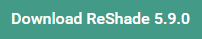
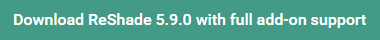
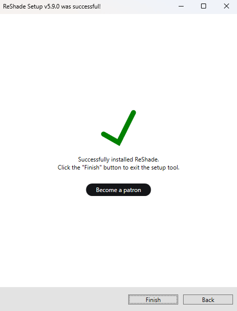
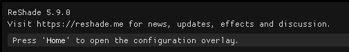

# Installing ReShade

 

ReShade is a shader-injection tool for all games and applications under the DirectX 9-12, OpenGL, and Vulkan graphics rendering APIs.

Similar to ENB, DXVK, or ASILoader, ReShade injects into your game in order to allow for unlimited creativity from its users so they can create the image that they desire.

This guide has been written in order to help guide you through the install process for ReShade so that you can utilize it in all of your games, and progress your knowledge for the fundamentals and advanced features of ReShade!

----------------

## Downloading the ReShade Installer

To start, download the latest version of ReShade by navigating to the [homepage for ReShade](https://reshade.me/#download). Once there, you need to scroll all the way down to the latest available versions to download. There will be two builds of ReShade that are avaliable for the latest install of ReShade.

{: .warning}
Do not download ReShade Installers or DLLs from unofficial sources outside of the official ReShade website: [https://reshade.me](https://reshade.me) Downloading and utilizing unofficial binaries can lead to various issues, including viruses. **Be Cautious!**

----------------

## Explaining the ReShade Builds
Once you are at the bottom of the site, you will be presented with two variations of the ReShade Installer.

There are large differences between these builds, and it is very important to understand what each build has to offer.

### Standard ReShade Build (Download ReShade x.x.x)

The first build option for you to choose is ReShade's standard build. 

This build is specificially to be used in games that endorse online play and have implemented anti-cheat or anti-tamper systems. These security measures, prevalent in many MMO and modern FPS games, help maintain an even playing field by preventing it's players from cheating. Some game developers have even created sophisticated driver-level anti-cheat systems to deploy in popular games.The Standard Build of ReShade is suited for gamers who frequent multiplayer games or games fortified with such security measures. 

Some online games, including Dead by Daylight, PlayerUnknown's Battlegrounds, and Apex Legends, permit this build of ReShade to inject while having an anti-cheat system - this is due to ReShade cutting access to the add-ons, when an online connection in the game is present. 

This add-on functionality is what powers depth-based shaders like iMMERSE MXAO, iMMERSE Pro RTGI, and CinematicDOF - and without the add-on functionality, these shaders do not work properly.

Although this provides a secure gaming experience, it can easily restrict the capabilities of shaders and hamper the full extent of users attainable visual enhancements.

----------------

### Full Add-On Support ReShade Build (Download ReShade x.x.x with full add-on support)

The second build option for you to choose is ReShade's full add-on support version. 

This build was designed primarily for single player games or games that don't use anti-cheat mechanisms. 

While it can be used in older games with less robust anti-cheats (for example: older Valve games using VAC or older idTech shooters using PunkBuster), you can still be putting yourself at risk of a ban. Therefore, we advise users to **be careful** and only inject this version in known games that do not list bans for ReShade or other graphics injections.

The largest difference in this version is the ability to use ReShade's add-on features. This version allows for ReShade users to utilize Add-ons (outside of Generic Depth) developed by community members. This version also allows you to utilize these Add-ons within a game that has a network connection. 

Add-ons are ReShade extensions that developers can code to maximize ReShade's potential. For reference, they can detect buffers in different ways or utilize various effects that tie deeply into your game. Addons other than Generic Depth are allowed in this version, but not the standard build of ReShade.

{: .warning }
The majority of the effects and add-ons are harmless, but if you deliberately use them for unfair advantages in games, you should expect a ban. There won't be any right to appeal since this is a clear violation - as ReShade modifies the game during runtime.

----------------

## Installing ReShade with the ReShade Installer
Once you have downloaded the appropriate version of ReShade, you'll need to run the downloaded executable. Once launched, you will be greeted with the ReShade installer.

Initially, the installer will prompt you to select a game or application that you want to inject ReShade to. It's recommended to explore the additional options offered by the installer!

Beneath the game selection box, you'll notice a search bar and a "Browse..." button. These features allow you to locate the game's executable directly. Clicking on "Browse..." opens the File Explorer, where you can pick the exact executable file for your game. Keep in mind that Desktop shortcuts are not the same as the game's executable file.

This method is particularly helpful if you're installing ReShade to a game downloaded from platforms like itch.io, older games without setup processes, or emulators such as DOSBox or Dolphin.

Once your game is selected properly, click the button labeled "Next..."

----------------

### Selecting the Rendering API
Upon clicking next, you will be greeted with a new page that hosts a selection of renderer names. This part is very important in the install process as you will need to pick the correct one.

Below is general information in order to take a best guess - however, we recommend using websites like Steam and PCGamingWiki in order to search for your title and make the appropriate selection.

{: .important }
Please remember, if you choose the wrong rendering API, ReShade will not inject properly!

----------------

DirectX 9 was widely used from early 2005 to late 2012. Most modern titles will opt to use newer DirectX versions or other rendering APIs. However, some games can also use DirectX 9 as a legacy or fallback renderer.

----------------

DirectX 10 to DirectX 12 is widely used for most industry-standard engines, such as Unity or Unreal Engine, and modern AAA games. When in doubt, select this option, as it should work. If not, the rendering API of the game will be one of the latter options. It is very rare for a game post-2012 to not utilize one of the renderers below.

----------------

OpenGL is still used today; especially to a few game engines (Like Unity and Godot), applications (Such as emulators, video players) and a few old games, especially old idTech / id Software titles (Quake Series, DOOM, sourceports of games, a few tools), if DirectX didn’t work and the title doesn’t use any “legacy” rendering options (Such as Direct3D, Glide or anything pre-2000), this is the renderer you want.

----------------

Vulkan is used as the main renderer for modern emulators (such as PS3, Switch, Xbox 360), and any recently released Bethesda / idSoftware titles (DOOM Eternal, DOOM 2016, Wolfenstein series.) Vulkan will be mandatory if used on Linux (via Wine) or with similar interfaces such as Steam’s Proton.

{: .important }
Installing ReShade using the Vulkan rendering API will require the ReShade installer to prompt the user for admin rights. This is due to the ReShade Installer needing to create a few files in the “ProgramData” folder of the PC and changes a few values in the registry. If you deny admin rights to the ReShade installer, installing ReShade for Vulkan will not work properly!

----------------

### Installing Presets
Installing presets has been made miles easier with the ReShade installer! No longer will you have to worry about finding the specific shaders that are used in presets. When selecting the preset file in the ReShade installer under the preset install section, the ReShade installer will automatically select the proper shaders and repos that you need for it to work properly! Please keep in mind that this method will not work properly for your preset if the preset requires unique shaders and textures that come with the preset archive!

In order to select the preset you want to install with ReShade, simply click the "Browse..." button on the bottom right hand corner of the ReShade installer.

{: .note }
ReShade presets will be in the form of {PresetName}.ini files.

----------------

### Installing Shaders
Shaders are what makes ReShade so valuable to it's users. They're the effects that you can toggle on and configure to get the specific look you want per game!

That being said, finding shader collections can be difficult, as each Shader Developer has their own methods of storing and updating shaders - however, the ReShade installer has made this much easier for users wanting to utilize shaders made by Shader Developers. If you installed a preset, there will already be marks set in this portion of the installer - if not, it should be blank other than "Standard Effects."

Each repository has two options for the user to select:
On the left hand side of the shader install portion of the ReShade installer window, you will notice a square tick, and a check tick. These two have different meanings. A square tick means that you are selectively installing the shaders from that repository, while a check tick means that you are getting all the shaders in the whole repository.

If you want to know more about the developer of each shader repository, you can also click the blue highlighted text where the repository name and author's name is, and it will open a page in your browser to their repository! Generally shader repositories have more information to each shader, and descriptions that might be valuable to a user.

Once you have the shaders selected that you want, simply click "Next"

If you have selected the square tick for any shader repositories, you will be greeted with a "Select {shader repository name} files to install screen. Simply select the shaders that you want from that repository and click next!

----------------

## Finalization
When you are completely done with installing ReShade through the ReShade installer, you will be greeted with a screen saying that ReShade has installed successfully. Simply click "Finish" and launch your game!

If you've done everything properly, ReShade will present a banner in game:

