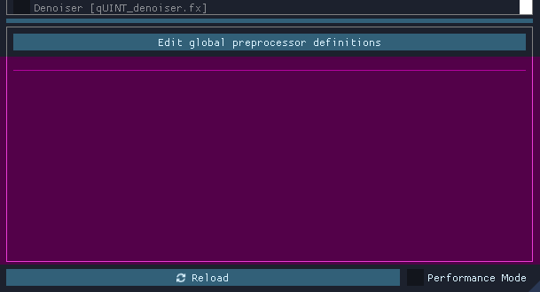
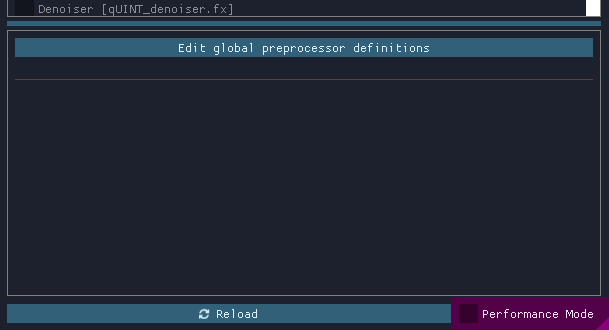
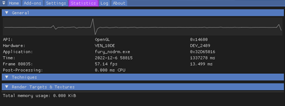
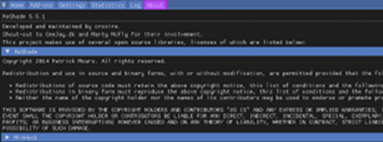

# Understanding ReShade's UI

So, after getting ReShade installed, the next step is to run the game and see if the ReShade popup appears on the top of the screen, if it does, congratulations! You have 70% of the work done. If not, try fiddling with the renderer settings again. 

A crucial step to start playing around with ReShade though, is getting acquainted with the UI, for this, press “HOME” on the Keyboard (or POS1 in a few other languages, this changes per Keyboard or locale) you can then follow the in-screen tutorial. (Make sure to follow it if you are a first-time user, reading does pay-off) However, if you skipped through it (pressed “Skip Tutorial” instead of “Continue”), we will assist you on what each part and button does. Make sure to follow and learn this properly so you have to worry less when our adventure with the Depth Buffer starts.

----------------

## Understanding the Home Tab

### Current Preset

The highlighted portion in the image above shows what preset is currently active within ReShade. Presets are saved in the game directory by default, and the default name for them is always ReShadePreset.ini, you can create a new one by clicking on the “+” button, save it by clicking on the Diskette-icon button and switch between them using the arrow buttons. ReShade tries to automatically detect which ini is a Preset, so you won’t have problems with ReShade picking up the wrong ini as a preset.

----------------

### Effect List

The highlighted portion in the image above shows the effect list within ReShade's "Home" tab. This portion of the "Home" tab is where all of your installed shaders live within the ReShade UI. Your list may be bigger or smaller depending on the effects the preset you downloaded uses, or the effect packs you installed back at the ReShade setup.

----------------

### Global Pre-processor Definitions

The highlighted portion ion the image above shows the "Edit Global Preprocessor Definitions" button within the ReShade "Home" tab. Pre-Processor definitions are “flags” or toggles which define how an effect should behave before it gets loaded. It's often used to change various shader behaviors or compatibility. This is important. Once you click it, it should open a small window:

The first tab shows which defines are “Global”, which means that they will get applied to every preset. By default, ReShade leaves those configured to its own effects, but you might add, edit or remove by clicking on the “Plus” and “Minus” signs. Make sure to always know the name of the pre-processor definition you need to change, and its min and max values. Shaders usually have those in comments. So, you will need to open the FX files with a advanced text editor to help with reading (Such as Notepad++).

The second tab shows which defines are valid for the “Current Preset”, which means they will change or reset to what is the shader’s default or the Global value for them when the preset is changed. This is useful if different presets use different pre-load values.

{: .note}
With a default ReShade preset, this tab will be blank

----------------

### Effect Parameters

The image above shows you the location of shader's effect parameters. When you enable a shader within ReShade, its options and parameters will appear there. Changes made here are changed in real-time, so you can always have the window a bit to the side to see what exactly is being altered on the image.

----------------

### Reload Button

This button, highlighted within the image above, forces ReShade to re-read the files on the Shaders and Textures folder, and add / include newly installed effects there, without having to quit and open the game again. This is also useful to see changes made to the shader code while programming.

----------------

### Performance Mode

This setting, highlighted within the image shown above, optimizes the compilation functions and how ReShade runs in the memory, making it less impactful on performance. Note that this will prevent edits to be made on the shaders and that some effects might not work well with it. In this case, you should always let the shader author know if there are any issues with the Performance Mode.

----------------

## Understanding Other ReShade Tabs

Here, you can choose what window you are viewing, this is very important because each window has its own set of options, we will guide you through them in the next few steps. By default, you will always start at “HOME” , but there are other tabs with their own set of options, those being:

### Addons Tab

This tab, highlighted in the image above, controls how each installed ReShade “Addon” works, by default, only “Generic Depth” is installed. Which is responsible on getting the depth buffer and selecting the correct one, we’ll look deeper into it later, for now, just know that this exists and can be used to control how each ReShade extension behaves.

----------------

### Settings Tab

This tab, highlighted in the image above, controls various important ReShade options, such as where the directories for Shaders are, the keys to open the menu, change between effects, FPS meter options , window theme and etcetera. Make sure to read through them all and experiment to make yourself more comfortable with the UI.

----------------

### Statistics Tab

This tab, highlighted in the image above, shows performance metrics, what the effects are using, how much they are consuming, how they are looking on each pass, how they work… Usually, you won’t need to look there much unless you are developing or measuring a shader’s performance.

----------------

### Log Tab

This tab, highlighted in the image above, shows ReShade’s “Log”, which writes how loading the shaders and ReShade itself went. If there are any errors or problems with a shader, they will be shown here, with YELLOW being a warning (incase an effect loaded, but certain functions and code could be better written or was changed during load), and RED being a error (Critical, prevented an effect from loading, usually followed by a description of the error), this is a very important tool for developers when they make their shaders, so if you see anything wrong, and you think a error or warning might be relevant, make sure to send them the resulting text, or sending the log file (all LOGs get saved on the game directory as ReShade.log, please note that the logs will be cleaned up once you leave and start the game again, so make sure to leave the game, send the log, and then send again to prevent loss of information).

----------------

### About Tab

This tab, highlighted in the image above, shows the credits of who worked / works in the development of ReShade, licenses, other code it used for its development and such. Mostly a formality.