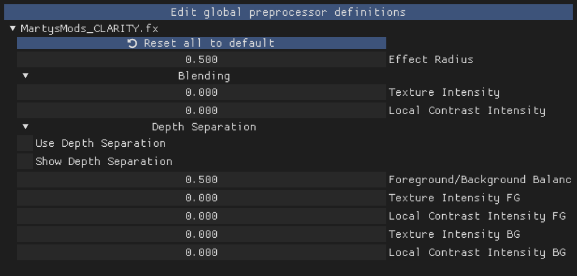

# Configuring iMMERSE Shaders

This guide page will walk you through each step of configuring the shaders under the entire iMMERSE suite.

Click the suite you'd like to start configuring below:

---

iMMERSE Shader Guides

This dropdown will serve as a guide for setting up and configuring specific shaders within the standard iMMERSE shader suite!

iMMERSE Anti Aliasing

iMMERSE Anti-Aliasing is a robust iteration of SMAA offering up to twice the performance of the original shader depending on your settings!

---

### Understanding the Basics of iMMERSE Anti Aliasing's Parameters

* Edge Detection Type - Different options given to the user in order to allow for customability in what type of edge detection is used. (Best being `Color edge detection (max)`)
* Enable Predicated Thresholding - Allows for iMMERSE Anti Alaiasing to utilize the depth buffer to better calculate edges that often get missed by the edge detection methods. (Best being enabled)
* Debug Output - Several options for the user to better configure iMMERSE Anti Aliasing
* SMAA_USE_EXTENDED_EDGE_DETECTION - This preprocessor for iMMERSE Anti Aliasing extends the color detection range of SMAA, allowing for increased detection of edges. (Usable Values: 0/1)

Configuring iMMERSE Anti Aliasing with Depth (Best Output)

### Step 1: Configuring iMMERSE Anti Aliasing for Best Output

1. Enable the `View edges` `Debug Output`.

2. Enable the `Color edge detection (max)` `Edge Detection Type`.

3. Check the option for `Enable Predicated Thresholding` - With this selected, you should notice a large decrease of edges that are being detected, this is normal, do not panic!

4. Reduce `Edge Detection Threshold` and `Depth Edge Detection Threshold` to the lowest value that they can go - This will increase the amount of edges that you see, we will configure this more as we go on.

5. Reduce `Predication Threshold` as low as it can go - If you already have this set to default values, this will likely not change much within your scene.

6. Increase `Predication Strength` just enough to the point where you notice no extra changes within the scene. This will increase the depth predication strength in order to grab more edges that are noticble in depth, but not by the edge detection method.

  * Good `Predication Strength` value debug output:

  

  * Poor `Predication Strength` value debug output:

  

7. Reduce `Predication Scale` as far as you can go without picking up noise from textures.

  * Good `Predication Scale` value debug output:

  

  * Poor `Predication Scale` value debug output:
  
  

8. If performance is permitting in your game and system, max out:
  * `Max Search Steps`
  * `Max Search Steps Diagonal`
  * `Corner Rounding`

  If performance is an issue, you can reduce these down to whatever value pleases your framerate choice.

---

From this point forward you should notice a decrease in shimmer and bright aliasing within your game. Note that this will not take away everything, but it can help enough to give you that extra smoothing to edges!

  * SMAA Enabled:

  

  * SMAA Disabled:

  

You can now disable `Debug Output` and continue to the game as usual!

---

iMMERSE Pro Shader Guides

This portion will serve as a guide for setting up and configuring specific shaders within the iMMERSE Pro shader suite!

iMMERSE Pro Clarity

Clarity is a shader that allows you to enhance texture and imaged details by adjusting the image's local contrast.

This allows you to add a soft glow or sharp, gritty textures to your game without the standard issues of haloing or noise.

Below is our guide on how to utilize Clarity to your advantage, and what you should look out for in order to get the best image possible!

Adding Details | No Depth Separation

Since Clarity is a local contrasting sharpener, you can easily get more precieved quality or "Clartiy" out of your game's textures, this guide will go over how to do so without destroying your image all together without using depth separation!

---

### Step 1: Enable the Shader

Simply check the shader `iMMERSE Pro Clarity [MartysMods_CLARITY.fx]` in the `Home` tab of ReShade.

This will activate Clarity and give you the arguments at the bottom to change.

---

### Step 2: Configure `Texture Intensity` for Increased Perception and Clarity

To configure `Texture Intensity` for increased perception and clarity in the scene, move the slider to the right.

This does not take much. 
You will notice that textures end up popping out more, and the contrast of the overall scene will increase.

However, do not go extremely overboard with this effect, as it can damage the game author's original envision for the game!

Example of the base game:

Example of a properly configured `Texture Intensity`:

Example of a poorly configured `Texture Intensity`:

Once you have configured this argument to your liking, you might notice that the scene is slightly darker than it should be - this is where `Local Contrast Intensity` will come into play!

---

### Step 3: Configure `Local Contrast Intensity` to Remove Some Contrast

In order to remove some contrast from the image, while still keeping the benifits that iMMERSE Pro Clarity has to offer, you can configure the `Local Contrast Intensity` argument!

This argument is touchy, so it only needs a little bit.

You are going to want to match the original game world's contrast with this, so that when you flick iMMERSE Pro Clarty on and off, you would see no difference in the white and black points!

Moving this slider to the right, will increase the local contrast intensity giving the image a brighter feeling, while moving it to the left and give you a darker feel.

Example of the base game:

Example of a properly configured `Local Contrast Intensity`:

Example of a poorly configured `Local Contrast Intensity`:

If you get results that are close to the original game, with the added benifits of increased texture resolve/quality - you have set up Clarity without any depth separation properly!

---

iMMERSE Ultimate Shader Guides

Coming Soon >:)

</details