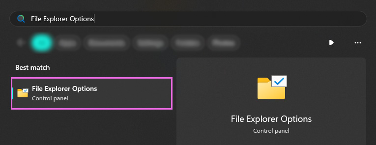
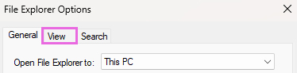

# Enabling Windows File Extensions

Windows does not come with File Extenions visable to the user.

This causes issues for individuals trying to see specific files within their game folder.

---

### Step 1: Search for `File Explorer Options` in the Windows Start Menu
This options menu is used to change the settings of Windows `File Explorer`.

This options menu is present on both Windows 10, and 11; so the process will be the same regardless of what Windows itteration you are on.

---

### Step 2: Switch to the `View` tab

* At the top of the options menu are three tabs.
1. Select the `View` tab

---

### Step 3: Uncheck `Hide extensions for known file types`

1. Untick the option for `Hide extensions for known file types`
2. Then click `OK` on the bottom right hand side of the options menu.

