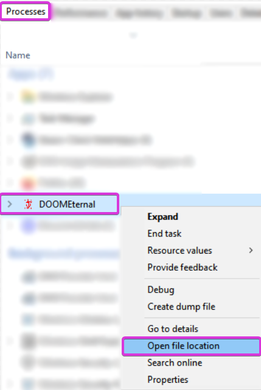
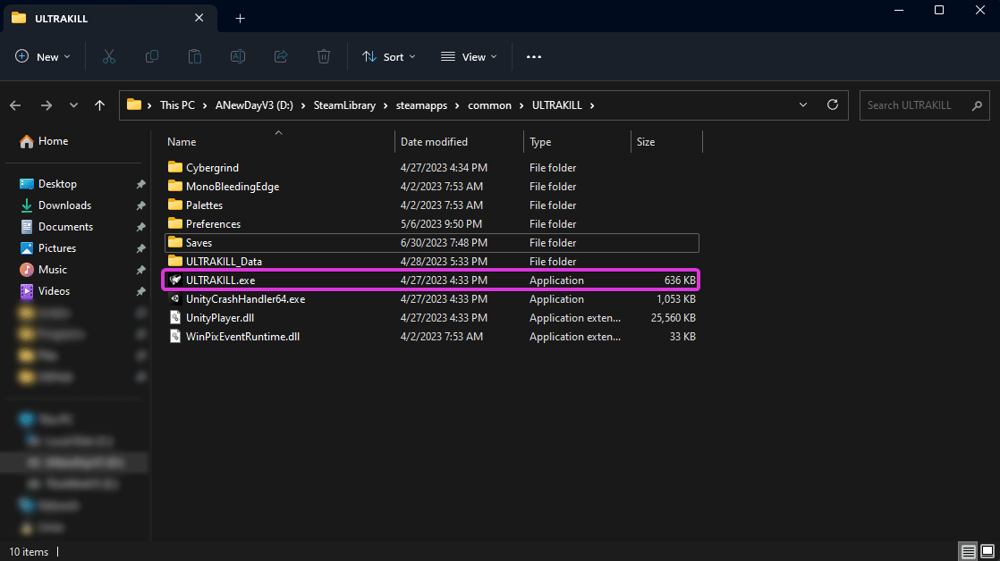

# Finding your Game's Proper Executable:

Unfortunately, every system is different, with varrying thoughts from different users.

With that in mind, each install of ReShade can be vastly different, and the ReShade Installer can behave differently depending on user's settings / game installs.

If you are struggling on finding a game's executable, this is a definitive guide showing you how to find the installs of the game the easiest.

----------------

## Global - PREFERED

### Step 1.
Open your game and Window's Task Manager. 
You can open Task Manager in various ways. 

1. Right click the Taskbar in Windows, and then click Task Manager. 
    

     
    Windows 11  
    

     
    Windows 10  

2. Control + Alt + Delete all pressed at the same time, and then click Task Manager.
3. Control + Shift + Escape all pressed at the same time.

----------------

### Step 2.
While your game is still open, Alt+Tab over to Task Manager. 
In the Processes list, you should be able to see your game. 

1. Right click your game in Task Manager's Processes tab.
2. Click `Open file location`.  
    

     
Windows 11  
    

     
Windows 10 

If Step 2. is done correctly, you should see your game's application highlighted in File Explorer.

In this area, you can note the location of the application you are looking for, as well as the specific game executable itself.

----------------

## Steam

### Step 1.
Open Steam and right click your game in the Steam "Library" tab, and then click "Properties". 
I will be using ULTRAKILL for this representation.

----------------

### Step 2.
With the new `Properties` window open, click the `Installed Files` tab on the left hand side of the window.

If you are on the right page, you will see `Installed Files` in bold text on towards the middle of the screen.

----------------

### Step 3.
In the `Installed Files` section of the `Properties` window, click the `Browse...` button on the right side of the window.

Once done, a File Explorer window with your game's executable and files will be present. The file with the `.exe` extention will be the executable.

This solution will NOT show you what your game's actual exectuable is.

This will only show you the location of where your game is installed, or where it's launching from in Steam!

Some games can have more than one executable, and it's up to you to determine which is the proper one!