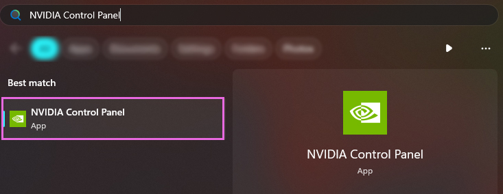
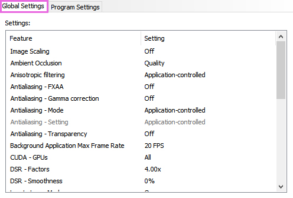

# Limiting your game's framerate.

While having the highest FPS can be seen as a good thing, it often comes with the side effect of not allowing shaders breathing room in ReShade.

The guides listed below will guide you through several different methods on how to limit your framerate!

------

AMD Adrenalin (Driver Based, AMD GPU Only, All Games)

This guide will provide you with the basics to limit your framerate using AMD Adrenalin's `Frame rate target control` function.

Keep in mind that this works globally, so it will force the framerate to what you set for ALL games on your system.

<h3>Step 1. - Open Adrenalin:</h3>

* __Easiest Method__ - Right click your desktop wallpaper, and click `AMD Software꞉ Adrenalin Edition`.
    

    
* Alternative Method - Search `Adrenalin` in the Windows Search Bar.
    

    

<h3>Step 2. - Enabling "Frame rate target control":</h3>

1. Click `Gaming` on the top most bar of the `Adrenaline` software, and then click `Graphics` in the second bar that has now appeared.
    

    
2. Scroll down to the `Advanced` portion of the `Graphics` tab and enable `Frame rate target control`.
    

    
3. Tune `Frame rate target control` to have the desired `Max FPS`.
    

    

------

NVIDIA Control Panel (Driver Based, NVIDIA GPU Only, All Games)

This guide will provide you with the basics to limit your framerate using NVIDIA's Control Panel `3D Settings` options for `Max Frame Rate`.

Keep in mind that this works globally, so it will force the framerate to what you set for ALL games on your system.

<h3>Step 1. - Open NVIDIA Control Panel:</h3>

* __Easiest Method__ - Right click your desktop wallpaper, and click `NVIDIA Control Panel`.
    

    
* Alternative Method - Search `NVIDIA Control Panel` in the Windows Search Bar.
    

    

<h3>Step 2. - Adjust the 3D Global Settings:</h3>

1. On the left hand corner, click `Manage 3D Settings`.
    

    
2. Ensure that you are within the `Global Settings` tab.
    

    
3. Enable `Max Frame Rate` and set the desired framerate between values 20 and 1000.
    

    

------

NVIDIA Control Panel (Driver Based, NVIDIA GPU Only, Specific Games)

This guide will provide you with the basics to limit your framerate using NVIDIA's Control Panel `3D Settings` options for `Max Frame Rate`.

Keep in mind that this works for only the game you set, so it will force the framerate to what you set for just the game you select.

<h3>Step 1. - Open NVIDIA Control Panel:</h3>

* __Easiest Method__ - Right click your desktop wallpaper, and click `NVIDIA Control Panel`.
    

    
* Alternative Method - Search `NVIDIA Control Panel` in the Windows Search Bar.
    

    

<h3>Step 2. - Adjust the 3D Global Settings:</h3>

1. On the left hand corner, click `Manage 3D Settings`.
    

    
2. Ensure that you are within the `Program Settings` tab.
    

    
3. Click the option on the right of the `Program to customize:` tab that says `Add`
    

    
4. Find the program that you are wanting to cap the framerate of.
    

    
5. Enable `Max Frame Rate` and set the desired framerate between values 20 and 1000.
    

    

