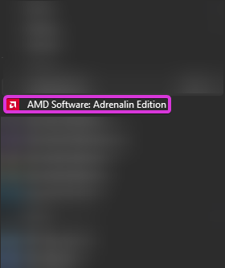
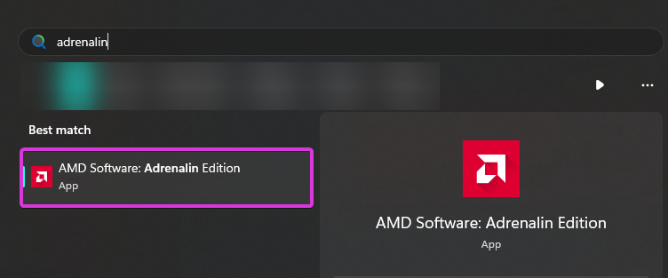
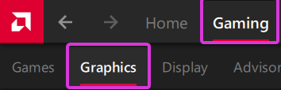
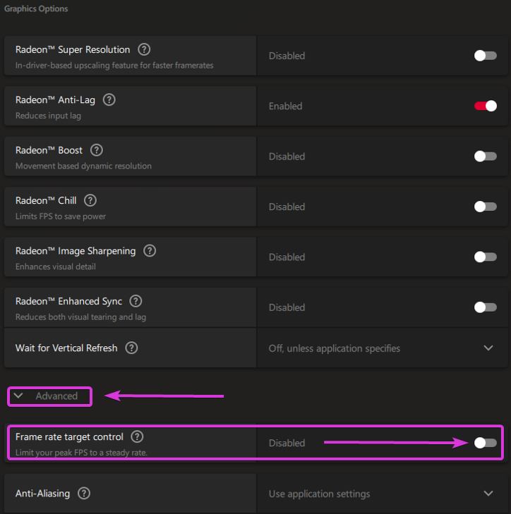

# Limiting your game's framerate.

While having the highest FPS can be seen as a good thing, it often comes with the side effect of not allowing shaders breathing room in ReShade.

The guides listed below will guide you through several different methods on how to limit your framerate!

-----

AMD Adrenalin (Driver Based, AMD GPU Only, All Games)

This guide will provide you with the basics to limit your framerate using AMD Adrenalin's `Frame rate target control` function.

Keep in mind that this works globally, so it will force the framerate to what you set for ALL games on your system.

<h3>Step 1. - Open AMD Adrenalin:</h3>

* __Easiest Method__ - Right click your desktop wallpaper, and click `AMD Software꞉ Adrenalin Edition`.
    

    

* Alternative Method - Search `Adrenalin` in the Windows Search Bar.
    

    
<h3>Step 2. - Enabling "Frame rate target control":</h3>

1. Click `Gaming` on the top most bar of the `Adrenaline` software, and then click `Graphics` in the second bar that has now appeared.
    

    

2. Scroll down to the `Advanced` portion of the `Graphics` tab and enable `Frame rate target control`.
    

    

3. Tune `Frame rate target control` to have the desired `Max FPS`.
    

    

-----

NVIDIA Control Panel (Driver Based, NVIDIA GPU Only, All Games)

This guide will provide you with the basics to limit your framerate using AMD Adrenalin's `Frame rate target control` function.

Keep in mind that this works globally, so it will force the framerate to what you set for ALL games on your system.

