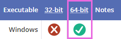
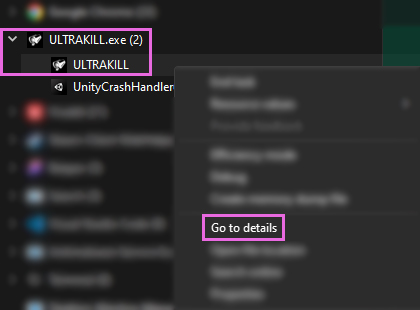
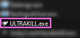

# Manual Install Guides
Add details here later

------

Installing ReShade Manually

Not all games allow ReShade to be installed via the ReShade Installer, this can be in regards to permissions issues that the installer would require administrative prompts for or even missing dependancies from the user.

However, this guide page exists to walk users through, and better understand how to install ReShade manually without the need of the installer so that they can get on their feet and get ReShade in their game!

------

### Step 1
Finding the proper architecture type of your game:

1. Visit the [PCGamingWiki](https://www.pcgamingwiki.com/wiki/Home).
2. Search for your game in the search bar.
    
3. Navigate towards the API tab of the page for your game (generally towards the end of the page.)
    

------

### Step 2.
Download the latest ReShade installer from the [ReShade Website](https://reshade.me)

------

### Step 3.
Download and install the latest `.msi` version of `7Zip` from [7Zip's official website](https://www.7-zip.org/download.html)
    

{: .note}
WinRar works as an alternative, but I will be using `7Zip` in this guide.

------

### Step 4.
Extract the `ReShadeXX.dll` you need for ReShade:
1. Right click the ReShade Installer `ReShade_Setup_x.x.x.exe`, hover over `7Zip`, and then click `Open Archive`
    
2. Extract the dll you need
    
    * `ReShade64.dll` - 64 Bit Binary of ReShade
    * `ReShade32.dll` - 32 Bit Binary of ReShade

------

### Step 5.
Rename the binary you have extracted to the proper injection name of your rendering API:
Right click the `ReShadeXX.dll` you just extracted from the ReShade Installer, and then click `Rename`

* Rename to the proper injection name for your rendering API
    * dxgi.dll - DirectX 10/11/12
    * d3d12.dll - DirectX 12
    * d3d11.dll - DirectX 11
    * d3d10.dll - DirectX 10
    * d3d9.dll - DirectX 9
    * opengl32.dll - OpenGL

------

### Step 6.
Place the dll that you have just renamed to fit your rendering API injection name in the root folder of your game.

The root folder of your game will be in the same location as your game's executable.

If you need help finding the specific executable of your game, [please refer to our guide on finding your game's executable!](https://guides.martysmods.com/docs/special_other/finding_your_game_executable.html)

When done, your game should launch automatically with ReShade!

------

Manually Injecting ReShade

Unfortunately, Not all games allow for ReShade to be injected automatically at run-time, which can be an issue for some users.

With that in mind, Crosire has built a tool in order to easily inject any form of DLL into games. This is most prominent in UWP (Microsoft Store) games, as most do not allow automatic injection.

{: .warning }
Since Crosire's Inject tool is an external injector, it is more prone to triggering anti-cheat systems - USE AT YOUR OWN RISK.

------

### Step 1
Finding the proper architecture type of your game:

1. Visit the [PCGamingWiki](https://www.pcgamingwiki.com/wiki/Home).
2. Search for your game in the search bar.
    
3. Navigate towards the API tab of the page for your game (generally towards the end of the page.)
     
  
------

### Step 2
Download the injector that matches the bit architecture of your game:
* [Inject64.exe](https://reshade.me/downloads/inject64.exe)
* [Inject32.exe](https://reshade.me/downloads/inject32.exe)

------

### Step 3
Download the latest ReShade Installer archive on the [ReShade website](https://www.reshade.me).

------

### Step 4.
Download and install the latest `.msi` version of `7Zip` from [7Zip's official website](https://www.7-zip.org/download.html)
    

{: .note}
WinRar works as an alternative, but I will be using `7Zip` in this guide.

------

### Step 5.
Extract the `ReShadeXX.dll` you need for ReShade:
1. Right click the ReShade Installer `ReShade_Setup_x.x.x.exe`, hover over `7Zip`, and then click `Open Archive`
    
2. Extract the dll you need
    
    * `ReShade64.dll` - 64 Bit Binary of ReShade
    * `ReShade32.dll` - 32 Bit Binary of ReShade

{: .highlight-title}
> Remember!
>
> This DLL has to be the same archtecture as the injection tool that you have downloaded previously.

------

### Step 6
Place the `injectXX.exe` file and `ReShadeXX.dll` file you have downloaded, into your game folder.
    

If you need help finding the specific directory of your game, [please refer to our guide on finding your game's executable!](https://guides.martysmods.com/docs/special_other/finding_your_game_executable.html)

------

### Step 7
Start the game that you want to inject ReShade into normally and open Task Manager to check the proccess name used by the game:
1. Open Task Manager
2. Right Click your application in the default proccesses tab and click `Go to Details.`
    

The executable highlighted will be the process name of your game.

------

### Step 8
Close your game, and navigate to the folder where your game exists. Inside the folder, you want to open a command prompt:

1. Type `CMD` in the address bar of File Explorer.
    
2. Type `inject[x32/x64].exe "name of the process here.exe"`, then press enter.
    
3. Start your game.

If done properly, you will now have ReShade injected into your game once it starts.
    

