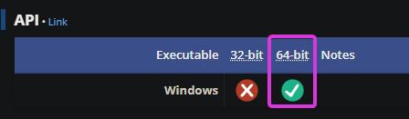

# Manually Injecting ReShade

----------------
## What is Manually Injecting?
Not all games allow for ReShade to be injected automatically at run-time, which can be an issue for some users. With that in mind, Crosire has built a tool in order to easily inject any form of DLL into games. This is most prominent in UWP (Microsoft Store) games, as most do not allow automatic injection.

{: .warning}
Since Crosire's Inject tool is an external injector, it is more prone to triggering anti-cheat systems - USE AT YOUR OWN RISK.

----------------

## Injecting Into Your Game

### Step 1
Finding the proper architecture type of your game:

1. Visit the [PCGamingWiki](https://www.pcgamingwiki.com/wiki/Home).
2. Search for your game in the search bar.
3. Navigate towards the API tab of the page for your game (generally towards the end of the page.)
4. Utilize that information to download the proper injector version in Step 2.
    

    
    

----------------

### Step 2
Then, download the proper injector for the architecture of your game:

* [Inject64.exe](https://reshade.me/downloads/inject64.exe)
* [Inject32.exe](https://reshade.me/downloads/inject32.exe)

----------------

### Step 3
Download the latest ReShade Installer archive on the [ReShade website](https://www.reshade.me).

----------------

### Step 4
Extract the proper DLL for the architecture of your game using 7Zip:

1. [7Zip Site.](https://www.7-zip.org/download.html)
2. Download the .MSI version of 7Zip.
3. Right Click the ReShade setup executable.
4. Hover over 7Zip.
5. Click Open Archive.
6. Pull out the proper DLL to any location that you want.

{: .highlight-title}
> Remember!
>
> This DLL has to be the same archtecture as the injection tool that you have downloaded previously.

----------------

### Step 5
Place the injector you have downloaded and the DLL you have extracted from the ReShade setup archive into your game folder.

----------------

### Step 6
Start the game that you want to inject ReShade into normally.

----------------

### Step 7
Open Task manager and check the proccess name used by the game:

1. Open Task Manager
2. Right Click your application in the default proccesses tab.
3. Click "Go to Details."
4. The executable highlighted will be the process name of your game.

----------------

### Step 8
Close your game, and navigate to the folder where your game exists. Inside the folder, you want to open a command prompt:

1. Right Click the inside of the directory and click "Open in Terminal" OR type `CMD` in the address bar.
2. Type `inject[x32/x64].exe "name of the process here.exe"`.
3. Press enter.
4. Start your game.

If done properly, you will now have ReShade injected into your game once it starts.