# Windows File Permisions

Often times, users install their games in folders like `Program Files (x86)`. This is a common practice as it helps keep all your programs neatly organized within a single folder. Some installers, like Steam, EA Play/Origin, Ubisoft Connect, or GOG Galaxy, may lock down these folders to maintain control over the games they install.

However, this approach can sometimes create problems. These locked-down folders may prevent other software, such as ReShade, from accessing the files it needs. ReShade requires both read and write access to specific files to work correctly.

In this guide, we will demystify the concept of file permissions in a user-friendly manner, making it accessible to even those with limited technical knowledge - however, this will be a challenge, so make sure that you follow closely!

{: .warning }
This method will only work for NTFS formatted drives. If you have any other drive formatting, you will not see a `Security` tab in the `Folder Properties` window.

---

### Step 1: Locate the Game Directory

{: .warning }
Before starting, ensure that your game is closed and that no files are open!

The game directory should always be displayed in the error for file permissions.

Utilize this in order to navigate towards the location that you are going to need to edit.

Alternatively, you can use our guide on [how to find your game directory](https://guides.martysmods.com/docs/special_other/finding_your_game_executable.html) to get to the proper location!

---

### Step 2: Enter the Properties of the Root Folder for Your Game

Let us use FFXIV as an example here:

Normally the game executable is within the folder `game`. Which would not be the root directory for FFIXV. Instead it would be `FINAL FANTASY XIV – A Realm Reborn\game`.

So you want to right click the folder called `FINAL FANTASY XIV – A Realm Reborn` **INSTEAD OF** `game`.

Once you've found the proper folder and right clicked it, click `Properties` at the bottom of the context menu.

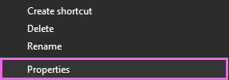

---

### Step 3: Navigate to the Security Tab

Within the `Folder Properties` window that has opened up, there should be a few tabs.

The tab you want to select is called `Security`.

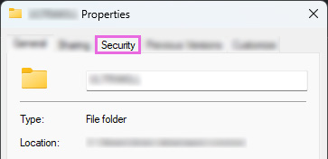

This will bring you to a quite confusing tab for most beginners, but this guide will walk you through every step that you would need in order to solve your issue.

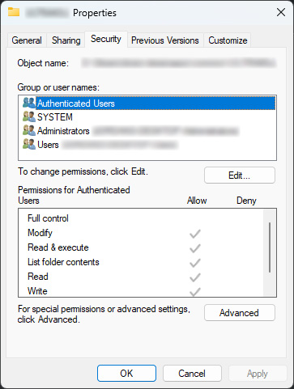

---

### Step 4: Click `Advanced`

On the bottom right hand corner of the `Security` tab, there will be an `Advanced` button.

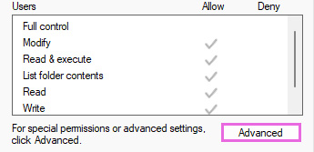

Click that, and a new window should open. This window is the `Advanced Security Settings` window, and will be home to all of the more advanced user settings for folders.

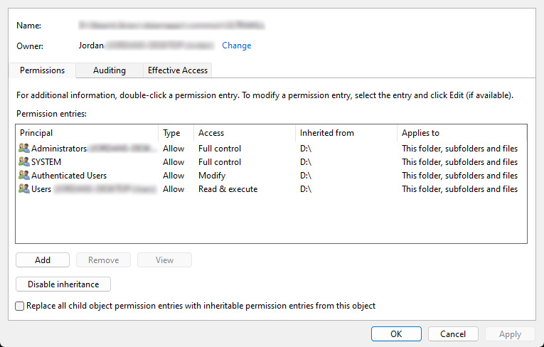

---

### Step 5: Change the Owner of the Folder

Towards the top of the `Advanced Security Settings` window, there will be two arguments:
* Name:
* Owner:

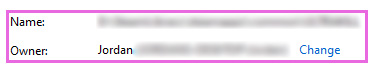

These two arguments give you vital information, such as the folder that you are changing the security settings of, as well as the owner of this directory.

You should have a blue option with a shield that says `Change` - click it.

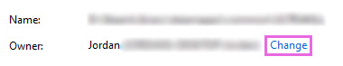

---

### Step 6: Changing the Owner of a Directory

Once you have clicked the blue `Change` button, a new window will appear with the title `Select User or Group`.

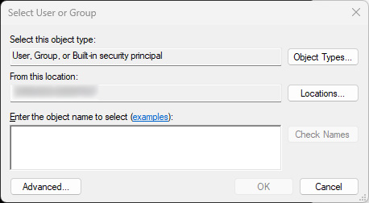

On the top right hand corner of the `Select User or Group` window, select `Object Types`.

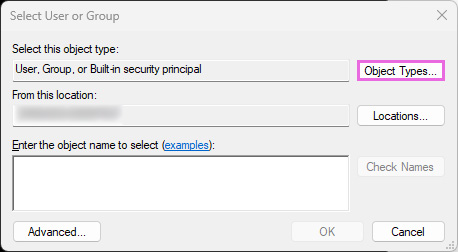

This will open a menu that gives you a few options for you to tick on and off - You want to only have `Users` ticked within this option - as it will help you later on in order to find your user!

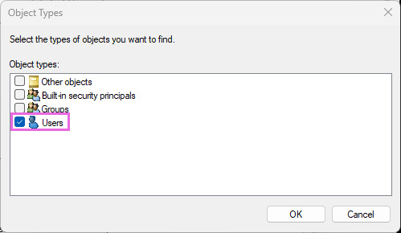

Once you only have `Users` checked in the new window, click `OK` at the bottom right hand corner.

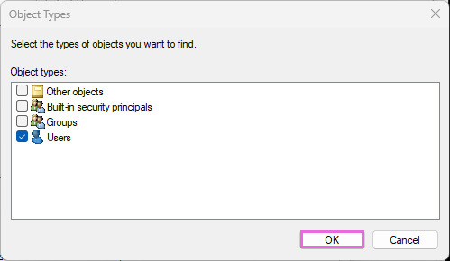

Clicking `OK` will bring you back to the previous `Select User or Group` menu - Notice how your object type has changed to only present `User`. This will help us to filter out all of the other objects that are able to be selected in the next few options!

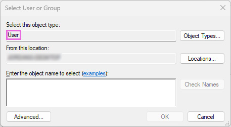

Now, click `Advanced` on the bottom left hand corner - this will bring you to the `Select User or Group (Advanced)` window.

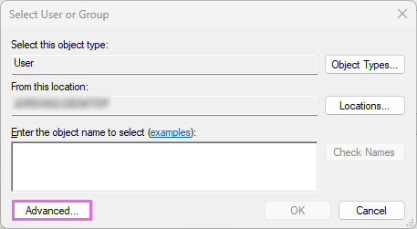

This new window that has appeared, called `Select User or Group (Advanced)`, is where we are going to select your user to become the owner of your game's file directory.

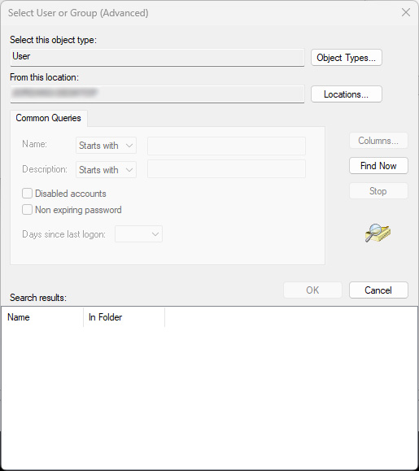

Click `Find Now` on the right hand side of the `Select User or Group (Advanced)` window - this will populate the bottom with all of the users that are on your system.

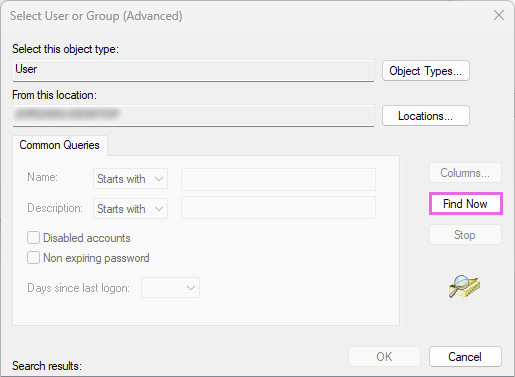

Here you should see your computer's user name. This username will be identical to the one that shows in your Start Menu and Windows Settings > Account window.

Double click your user!

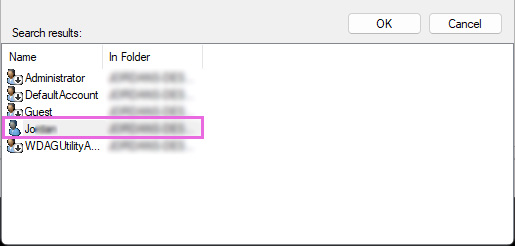

That will have filled in the location of your user within the `Select User or Group` window. If you have a prompt under `Enter the object name to select (examples):` text portion. You have likely done this process right.

Ensure that the prompt that was entered in that portion is also underlined, that means that the prompt is aware that this is an actual user on your system.

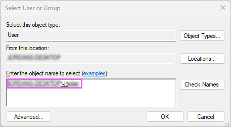

Simply click `OK` in the bottom right hand corner of the `Select User or Group` window.

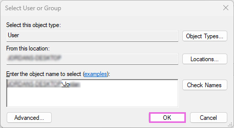

---

### Step 7: Check `Replace owner on subcontainers and ojects`

Once you have clicked `OK` in the `Select User or Group` window, you will be ported back to the `Advanced Security Settings` window. This is normal.

You should see a new setting appear for you to toggle that you might not remember before called `Replace owner on subcontainers and objects`.

Please ensure that `Replace owner on subcontainers and ojects` is checked within the `Advanced Security Settings`. This tick will be under the `Owner:` argument.

**This step is crucial, as if it's not applied to all files within the folder, you will have to repeat this entire process!**

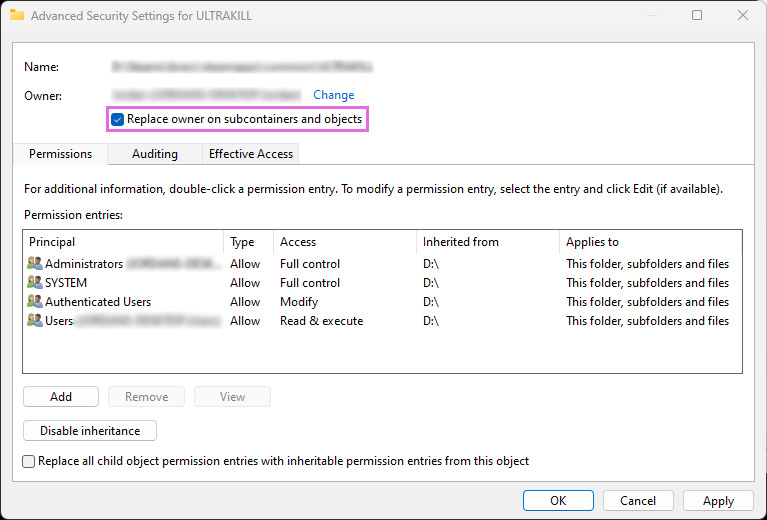

Once that is done, hit `Apply` at the bottom right hand corner of the `Advanced Security Settings` window.

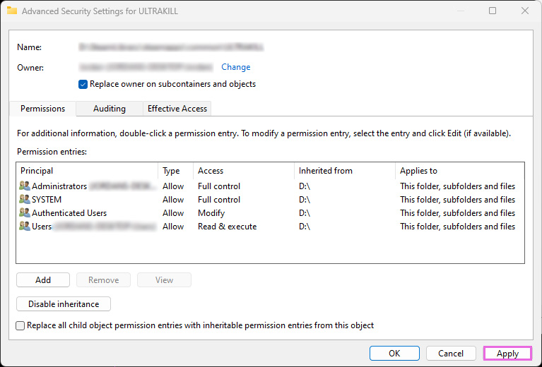

You will get a prompt in the middle of your screen, this prompt is ensuring the user to not panic if they do not see changes to the `Security` tab immediately, you can ignore this for now by clicking `OK`.

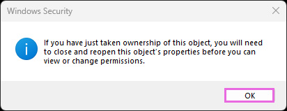

Afterwards, you will see the `Replace owner on subcontainers and object` option completely removed from your `Advanced Security Settings` window - this is normal, and means that you have done this right!

---

### Step 8: Add Your User with `Full Control` Access to the Game Directory

Now that you have changed the game directory to your owner, you want to add a profile that states that your user is now in full control of the game directory.

Click `Add` on the bottom right hand corner of the `Advanced Security Settings` window.

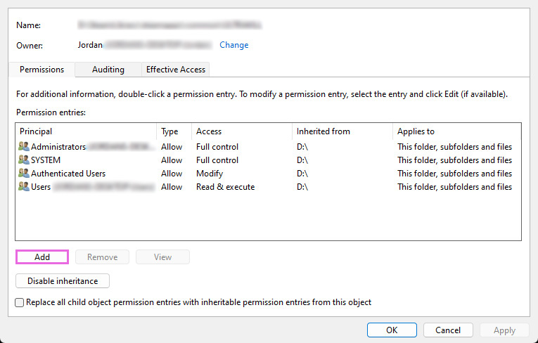

A new window called `Permissions Entry` will appear - Click `Select a principal` at the top of the window.

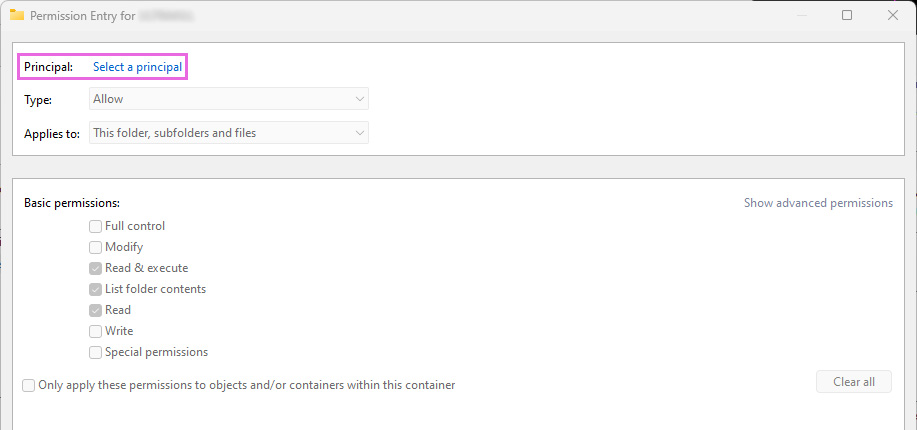

This will give you the same `Select User or Group` window as before in order to select your user - Click `Advanced` like you have done previously.

Now click `Find Now` on the right hand side of the of the `Select User or Group (Advanced)` window, and then double click your user!

This will then close the `Select User or Group (Advanced)` window and bring you back to the standard `Select User or Group` window with your computer name and username underlined in the object box - Select your user again by double clicking the object with your username!

This will now fill in the `Principal:` option at the top of the `Permissions Entry` window!

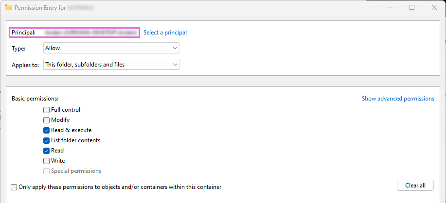

Towards the middle of the `Permissions Entry` you should see `Basic Permissions:`

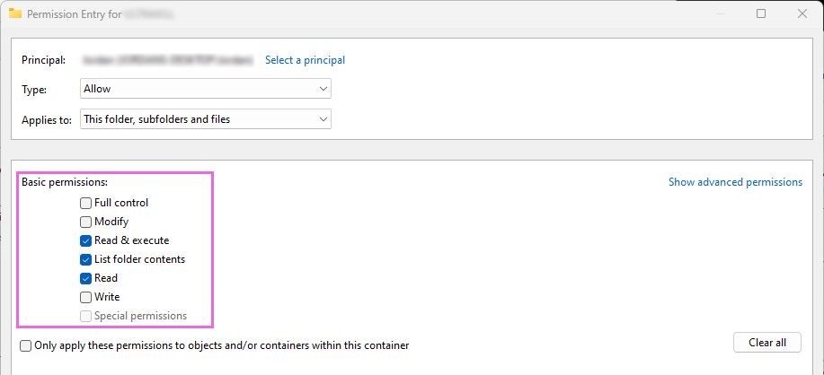

Ensure that `Full Control` is selected, and then press `OK` at the bottom right hand corner of the `Permissions Entry` window!

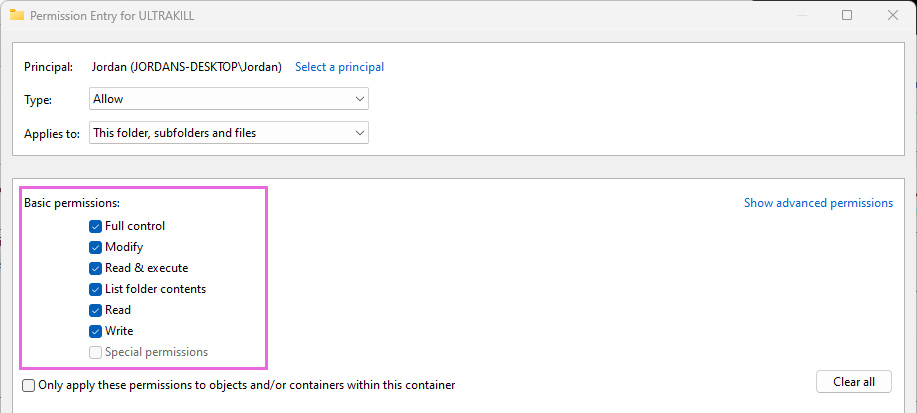

This will take you back to the `Advanced Security Settings` window, and you should see your user added under the `Principal` tag with `Full Control` set as the `Access` paramater!

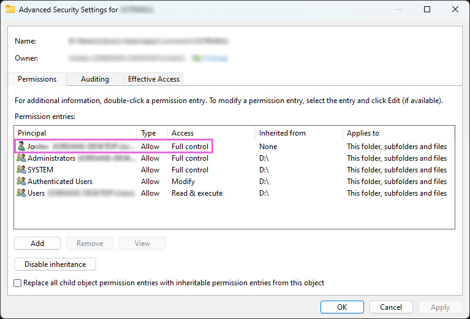

This means that you have done everything correctly - Now, simply hit `OK` at the bottom right hand corner of the `Advanced Security Settings` window!

You are finished - Relaunch your game and verify that the folder/file permissions error is gone in ReShade!
