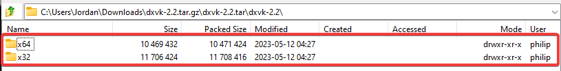

# Using ReShade with a Rendering API Wrapper

A rendering API wrapper, is a tool used in various froms in order to "wrap" one rendering API to another. The most common form of this is wrapping older APIs such as DirectX 9 to newer APIs like Vulkan.
This can provide all sorts of new things for users, such as allowing their ReShade to properly compile shaders, and sometimes implementing performance enhancements for older games.

------

Installing DXVK

DXVK is a utilized used to wrap DirectX titles over to Vulkan! This is most used in order to wrap older APIs like DirectX 9 over for use with newer compute shaders that do not work in DirectX 9!

### Step 1
Grab the latest release of DXVK from [https://github.com/doitsujin/dxvk/releases](https://github.com/doitsujin/dxvk/releases)

------

### Step 2
Navigate to your game folder - For this instance, I am using ULTRAKILL here as an example.

------

### Step 3
Use [PCGamingWiki](https://pcgamingwiki.com/) for reference of what rendering API and architecture that your game is:

PCGamingWiki showing the game's original API

PCGamingWiki showing the game's original bit architecture

------
   
### Step 4 
* Open the DXVK archive dxvk-2.2.tar.gz (You will need a archive opener like [7zip](https://www.7-zip.org/)!)

* Navigate to the into the dxvk-2.2.tar file, then into the dxvk-2.2 folder.  
    You will then see two folders, one labeled x64 and another labeled x32. 

{: .highlight}
The folder you pick here is based off of the information related to architecture on PCGamingWiki in step 3!

------

### Step 5 
Navigate into the architecture folder that relates to your game, and you will see several files - each of these files relates to the rendering api that you found on PCGamingWiki.

{: .highlight-title}
> File Names and Associated Architectures.
>
> * dxgi.dll - DX11/DX12
> * d3d11.dll - DX11
> * d3d10core.dll - DX10
> * d3d9.dll - DX9

------

### Step 6 
Drag the file that you need into the directory that your game is located in - the file needs to be in the same location as the executable!

------

### Step 7
Reinstall ReShade using the Vulkan API for your game, and test! 

{: .warning}
If ReShade does not appear when you have installed it as Vulkan, you have either chosen the wrong application, or have applied the wrong bit architecture/dll file to the game's folder.

------

Installing DGVoodoo 2

COMING SOON! TM

