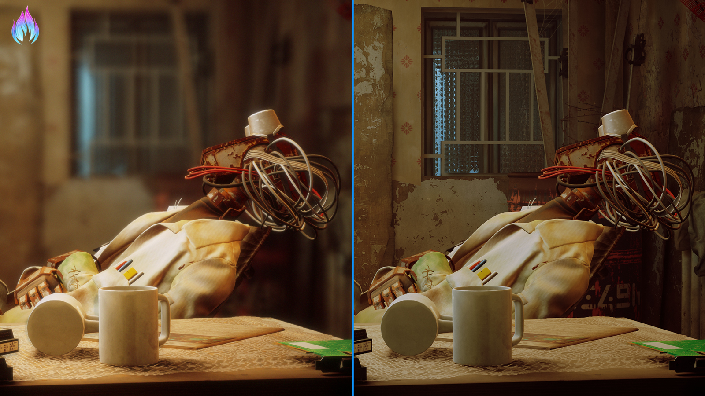

# Marty's Mods Guide Site
{: .text-center}

{: .text-center}

---

## Welcome to our guide site!
{: .text-center}

In order to navigate our guide site, please use the navigation bar on the left hand side of your screen. There you will find organized guides that will help you to learn and understand ReShade better, alongside other more helpful guides that can help walk you through some of the issues that plague users!

---

## What is ReShade?
{: .text-center}

Simplifying things as much as possible:

ReShade is a tool that can allow you to transform your game with shaders and presets in real-time. These shaders can just about do anything from change the way colors look, or do more advanced magic such as raytraced global illumination!

---

## Where can I install ReShade?
{: .text-center}

You can learn all about downloading and installing ReShade through our ReShade guides.

---

[ >>>> Downloading and Installing ReShade](https://guides.martysmods.com/docs/reshade-guides/downloading-and-installing-reshade/){: .btn .btn-blue .mr-4 }